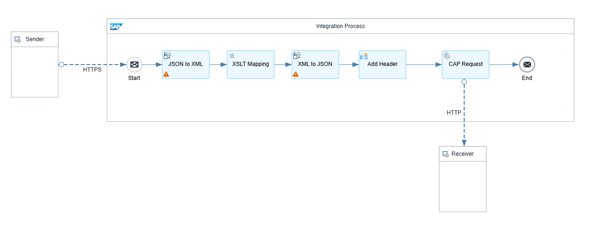
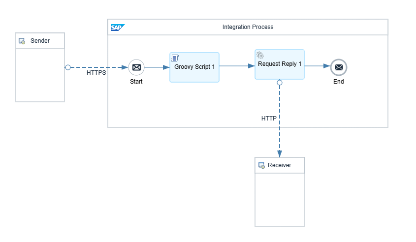

## Projeto Integration

### **Interface – ImportPerson**

**Finalidade:**  
Importar uma lista de pessoas (ID + Nome) do CPI para o banco de dados do CAP.

**Fluxo no CPI:**
1. **Sender Adapter:** HTTPS (POST)
2. **JSON to XML Converter**
3. **XSLT Mapping:** mapeia campos `identificador → id` e `nomeColab → name`
4. **XML to JSON Converter**
5. **Add Header:** adiciona `Content-Type: application/json`
6. **HTTP Receiver:** envia o JSON final para o endpoint CAP `/person/importData`

**Entrada (JSON):**
```json
{
  "payload": {
    "data": [
      { "identificador": 1, "nomeColab": "Alice" },
      { "identificador": 2, "nomeColab": "Bob" },
      { "identificador": 3, "nomeColab": "Leo" }
    ]
  }
}
```

**Saída esperada (via CAP):**
```
HTTP 204 - Dados importados com sucesso
```
**Fluxo visual:**


---

### **Interface – GetPerson**

**Finalidade:**  
Consultar o nome de uma pessoa no CAP pelo ID.

**Fluxo no CPI:**
1. **Sender Adapter:** HTTPS (GET)
2. **Groovy Script:** extrai o parâmetro `id` do header/query e define como `property.id`
3. **Request Reply:** faz requisição GET ao CAP (`/person/getNameById?id=${property.id}`)
4. **HTTP Receiver:** encaminha a resposta do CAP para o chamador

**Exemplo de chamada (Postman):**
```
GET https://<cpi-url>/http/GetPerson?id=3
```

**Resposta:**
```json
{
  "@odata.context": "$metadata#Edm.String",
  "value": "Joao"
}
```
**Fluxo visual:**

