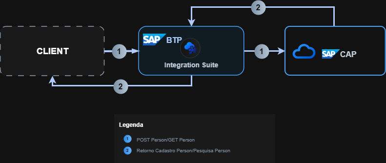

# CAP Integration Project

Este repositório demonstra uma integração entre **SAP CAP** e **SAP Cloud Integration (CPI)**, criando um fluxo de comunicação bidirecional entre aplicações Node.js OData e integrações de middleware.

---

## Visão Geral do Projeto

O objetivo deste projeto é integrar um serviço CAP local (exposto via OData) com o **SAP CPI**, realizando:
- O **envio de dados (POST)** de uma lista de pessoas do CPI para o CAP.
- A **consulta de dados (GET)** do CAP por meio de requisições via CPI.

A arquitetura permite validar dados, transformar estruturas JSON/XML e expor endpoints integrados para testes no Postman ou sistemas externos.

---

## 🧩 Estrutura do Repositório

```
Cap_CPI-Project/
├── cap_project/              # Projeto CAP (Node.js + OData)
│   ├── srv/
│   ├── db/
│   ├── package.json
│   └── README.md
│
├── integration_project/      # Projeto CPI (iFlows exportados)
│   ├── Interface-ImportPerson.png
│   ├── Interface-GetPerson.png
│   └── Iflows.zip
│
├── CPI_CAP_Arquitetura.png   # Arquitetura Geral CAP + CPI
└── README.md                 # Este arquivo
```

---

## 🏗️ Arquitetura da Solução



1. **CPI ImportPerson** recebe um JSON de entrada via HTTPS.
2. O payload é transformado (JSON → XML → JSON) por meio de um **XSLT Mapping**.
3. O JSON final é enviado para o **CAP service** (endpoint `/odata/v4/person/importData`).
4. **CPI GetPerson** consome o endpoint `/odata/v4/person/getNameById` passando o parâmetro `id`.
5. O CAP retorna o nome correspondente ao ID informado.

---
