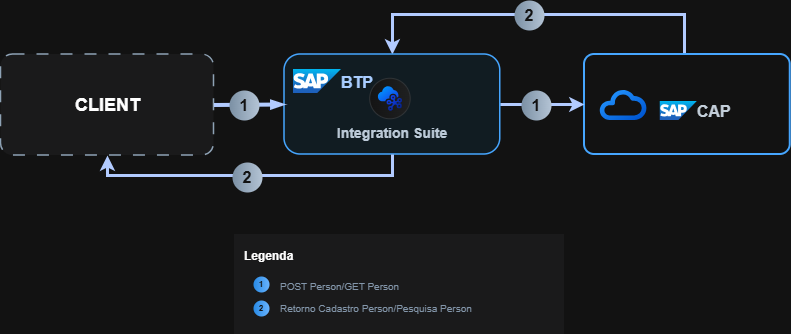

# 🌐 CAP Integration Project — SAP BTP + CPI

Este repositório demonstra uma integração completa entre **SAP Cloud Application Programming Model (CAP)** e **SAP Cloud Integration (CPI)**, criando um fluxo de comunicação bidirecional entre aplicações Node.js OData e integrações de middleware.

---

## 📘 Visão Geral do Projeto

O objetivo deste projeto é integrar um serviço CAP local (exposto via OData) com o **SAP CPI**, realizando:
- O **envio de dados (POST)** de uma lista de pessoas do CPI para o CAP.
- A **consulta de dados (GET)** do CAP por meio de requisições via CPI.

A arquitetura permite validar dados, transformar estruturas JSON/XML e expor endpoints integrados para testes no Postman ou sistemas externos.

---

## 🧩 Estrutura do Repositório

```
cap-integration-project/
├── cap_project/              # Projeto CAP (Node.js + OData)
│   ├── srv/
│   ├── db/
│   ├── package.json
│   └── README.md
│
├── integration_project/      # Projeto CPI (iFlows exportados)
│   ├── Interface-ImportPerson.png
│   ├── Interface-GetPerson.png
│   └── Iflows.zip
│
├── CPI_CAP_Arquitetura.png   # Arquitetura Geral CAP + CPI
└── README.md                 # Este arquivo
```

---

## 🏗️ Arquitetura da Solução



1. **CPI ImportPerson** recebe um JSON de entrada via HTTPS.
2. O payload é transformado (JSON → XML → JSON) por meio de um **XSLT Mapping**.
3. O JSON final é enviado para o **CAP service** (endpoint `/odata/v4/person/importData`).
4. **CPI GetPerson** consome o endpoint `/odata/v4/person/getNameById` passando o parâmetro `id`.
5. O CAP retorna o nome correspondente ao ID informado.

---

## 🔄 Interfaces Desenvolvidas

### **1️⃣ Interface – ImportPerson**

**Finalidade:**  
Importar uma lista de pessoas (ID + Nome) do CPI para o banco de dados do CAP.

**Fluxo no CPI:**
1. **Sender Adapter:** HTTPS (POST)
2. **JSON to XML Converter**
3. **XSLT Mapping:** mapeia campos `identificador → id` e `nomeColab → name`
4. **XML to JSON Converter**
5. **Add Header:** adiciona `Content-Type: application/json`
6. **HTTP Receiver:** envia o JSON final para o endpoint CAP `/person/importData`

**Entrada (JSON):**
```json
{
  "payload": {
    "data": [
      { "identificador": 1, "nomeColab": "Alice" },
      { "identificador": 2, "nomeColab": "Bob" },
      { "identificador": 3, "nomeColab": "Leo" }
    ]
  }
}
```

**Saída esperada (via CAP):**
```
HTTP 204 - Dados importados com sucesso
```

**Fluxo visual:**


---

### **2️⃣ Interface – GetPerson**

**Finalidade:**  
Consultar o nome de uma pessoa no CAP pelo ID.

**Fluxo no CPI:**
1. **Sender Adapter:** HTTPS (GET)
2. **Groovy Script:** extrai o parâmetro `id` do header/query e define como `property.id`
3. **Request Reply:** faz requisição GET ao CAP (`/person/getNameById?id=${property.id}`)
4. **HTTP Receiver:** encaminha a resposta do CAP para o chamador

**Exemplo de chamada (Postman):**
```
GET https://<cpi-url>/http/GetPerson?id=3
```

**Resposta:**
```json
{
  "@odata.context": "$metadata#Edm.String",
  "value": "Joao"
}
```

**Fluxo visual:**


---

## 🧠 Lógica CAP (Node.js)

### **Serviço CAP — calc-service.js**

```js
module.exports = async function () {
  const { Person } = cds.entities('my');

  // Importa os dados via POST
  this.on('importData', async req => {
    const list = req.data.payload?.data || [];
    if (!Array.isArray(list)) return req.error(400, 'Payload inválido');
    await INSERT.into(Person).entries(list);
    return 'Dados importados com sucesso';
  });

  // Retorna o nome via GET
  this.on('getNameById', async req => {
    const { id } = req.data;
    const person = await SELECT.one.from(Person).where({ id });
    if (!person) return `ID ${id} não encontrado`;
    return person.name;
  });
};
```

---

## ⚙️ Tecnologias Utilizadas

| Componente | Descrição |
|-------------|------------|
| **SAP CPI (Integration Suite)** | Criação e orquestração dos iFlows |
| **SAP CAP (Node.js)** | Backend OData exposto para comunicação |
| **Groovy Script** | Manipulação de propriedades e parâmetros HTTP |
| **XSLT Mapping** | Conversão XML entre estruturas distintas |
| **Ngrok** | Exposição de endpoint local CAP para o CPI |
| **Postman** | Testes de integração |

---

## 🚀 Como Executar o Projeto

### 1️⃣ Rodar o CAP localmente
```bash
cd cap_project
npm install
cds watch
```
Endpoint local:  
```
http://localhost:4004/odata/v4/person/
```

### 2️⃣ Publicar via Ngrok
```bash
ngrok http 4004
```
Copie o URL HTTPS gerado e utilize no CPI como **receiver endpoint**.

### 3️⃣ Testar via Postman
**POST:** `/person/importData`  
**GET:** `/person/getNameById?id=1`

---

## 🧾 Autor
**Leonardo Zucatti**  
SAP Integration Developer | CAP + CPI Specialist  
📧 leonardozucatti@gmail.com  
🔗 [github.com/leonardozucatti](https://github.com/leonardozucatti)

---

## 🏁 Licença
Este projeto é distribuído sob a licença **MIT**.  
Sinta-se livre para estudar, modificar e aprimorar.
