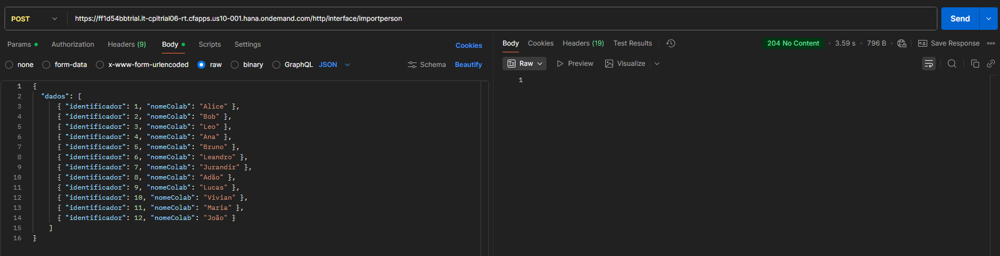
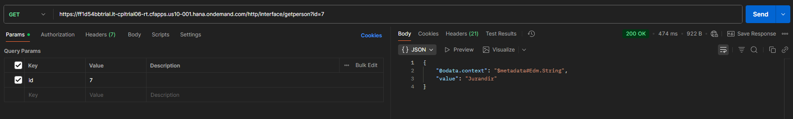

# Testes — Integração CAP + CPI

Esta seção documenta os **testes realizados** para validar a integração entre o **SAP CAP** e o **SAP Cloud Integration (CPI)**, confirmando a comunicação bidirecional entre os serviços OData e os iFlows configurados.

---

## Execução do Servidor CAP

A aplicação CAP foi iniciada em modo de observação (watch) e executada em **banco de dados em memória**, utilizando o comando:

```bash
cd cap_project
cds watch
```

**Resultado no terminal:**
- O serviço `PersonService` foi iniciado em `http://localhost:4004`
- Endpoints disponíveis:
  - `POST /odata/v4/person/importData`
  - `GET  /odata/v4/person/getNameById?id={id}`

**Captura:**


---

## Teste de Importação — Interface ImportPerson

**Objetivo:** validar o envio de uma lista de pessoas via **CPI** para o serviço CAP.

### Endpoint CPI:
```
POST https://<cpi_host>/http/interface/importperson
```

### Payload de entrada:
```json
{
  "dados": [
    { "identificador": 1, "nomeColab": "Alice" },
    { "identificador": 2, "nomeColab": "Bob" },
    { "identificador": 3, "nomeColab": "Leo" },
    { "identificador": 4, "nomeColab": "Ana" },
    { "identificador": 5, "nomeColab": "Bruno" },
    { "identificador": 6, "nomeColab": "Leandro" },
    { "identificador": 7, "nomeColab": "Jurandir" },
    { "identificador": 8, "nomeColab": "Adão" },
    { "identificador": 9, "nomeColab": "Lucas" },
    { "identificador": 10, "nomeColab": "Vivian" },
    { "identificador": 11, "nomeColab": "Maria" },
    { "identificador": 12, "nomeColab": "João" }
  ]
}
```

### Resposta:
```
HTTP 204 No Content
```

**Resultado esperado:**  
Os dados são processados com sucesso e armazenados na base in-memory do CAP.

**Captura:**


---

## Teste de Consulta — Interface GetPerson

**Objetivo:** validar a consulta de um registro específico pelo `id`.

### Endpoint CPI:
```
GET https://<cpi_host>/http/interface/getperson?id=7
```

### Resposta:
```json
{
  "@odata.context": "$metadata#Edm.String",
  "value": "Jurandir"
}
```

**Resultado esperado:**  
O CAP retorna corretamente o nome associado ao `id` informado.

**Captura:**


---

## Conclusão

**Ambas as integrações foram validadas com sucesso.**

| Interface | Método | Status | Descrição |
|------------|---------|---------|------------|
| **ImportPerson** | POST | Sucesso (204) | Envia e insere registros no CAP |
| **GetPerson** | GET | Sucesso (200) | Consulta e retorna o nome pelo ID |

